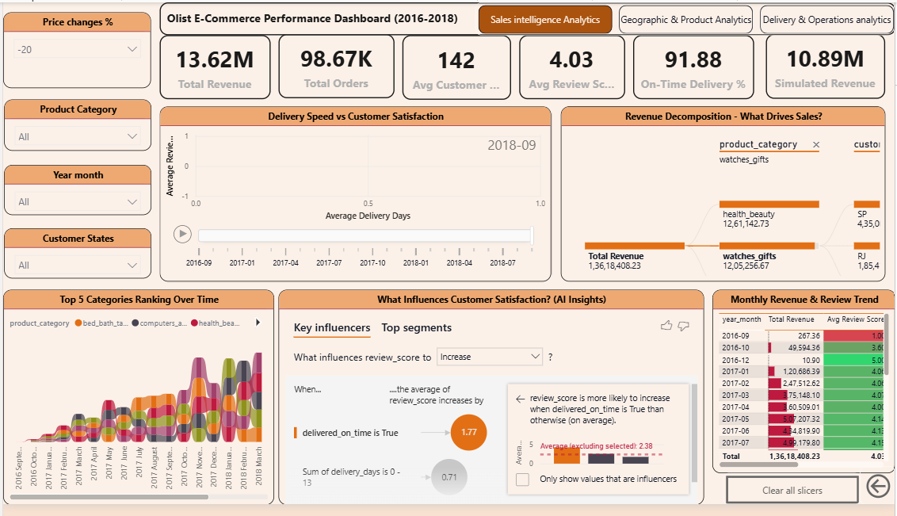
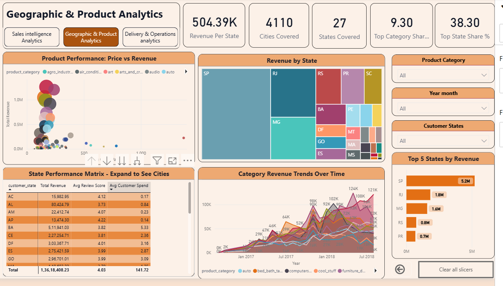
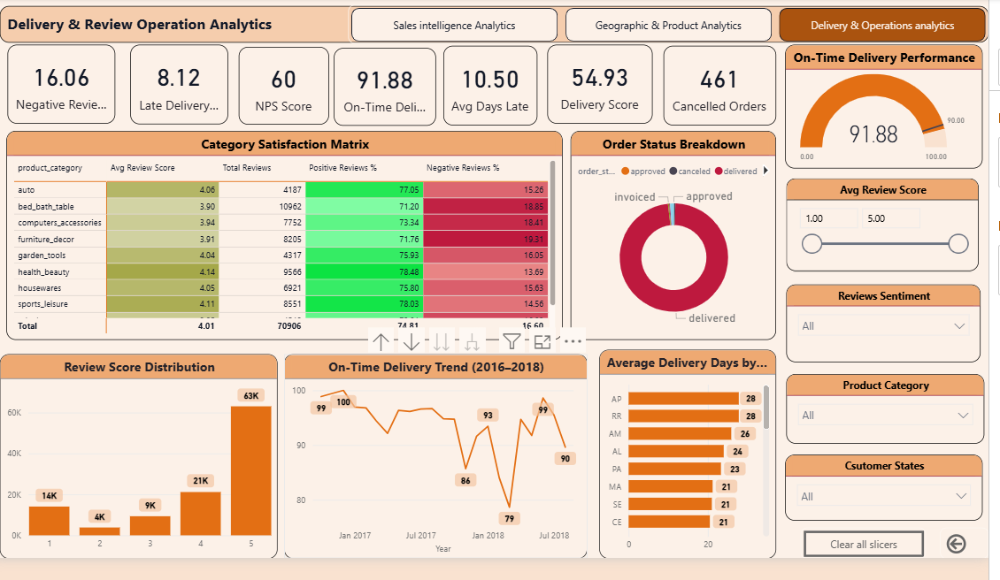

# Olist E-Commerce Analytics Dashboard

> **End-to-end data analytics project** featuring a full Azure cloud pipeline, advanced Power BI dashboards with AI-powered insights, and a production-grade star schema — built on Brazilian e-commerce data.

[](https://www.postgresql.org/)
[](https://powerbi.microsoft.com/)
[](https://azure.microsoft.com/)



---

## 📊 Project Overview

This project demonstrates a **complete, production-grade data analytics workflow** — from raw CSV files through to an interactive Power BI dashboard — featuring:

- **Azure cloud pipeline**: Blob Storage → Azure Data Factory → Azure PostgreSQL
- **8 raw source tables** cleaned and loaded via automated ADF pipeline
- **Star schema data warehouse** with 4 dimensions + 1 fact table (112,650 records)
- **40+ DAX measures** for advanced analytics
- **3 interactive dashboard pages** with AI/ML features
- **Advanced visualizations** including decomposition trees, key influencers, and what-if simulation

---

## ☁️ Azure Cloud Extension

This project was built on a full **Azure cloud data pipeline** — replacing a local PostgreSQL setup with a production-grade cloud architecture.

### Pipeline Architecture

```
Azure Blob Storage (raw CSVs)
          ↓
Azure Data Factory (automated ETL pipeline)
          ↓
Azure PostgreSQL — raw.* (8 source tables, 112,650+ records)
          ↓
Azure PostgreSQL — cleaned.* (Star Schema)
          ↓
Power BI Desktop (connected to cloud database)
```

### Pipeline in Azure Data Factory


### Azure Services Used

| Service | Role | Free Tier |
|---|---|---|
| Azure Blob Storage | Raw CSV file storage | ✅ 5 GB free |
| Azure Data Factory | ETL pipeline with scheduled trigger | ✅ 1K runs/month |
| Azure PostgreSQL Flexible Server | Cloud-hosted star schema database | Credits used |
| Azure Key Vault | Secrets management for credentials | ✅ 10K ops free |
| Azure Monitor | Pipeline failure alerts, cost budgets | ✅ Basic free |

### Key Cloud Concepts Demonstrated

- **Linked Services** — connecting ADF to Blob Storage and PostgreSQL
- **Datasets** — parameterized source/sink data pointers
- **Copy Activities** — automated CSV → PostgreSQL data loading
- **Pre-copy scripts** — TRUNCATE before load to prevent duplicates
- **Pipeline orchestration** — dimension tables loaded before fact table (foreign key order)
- **CTE-based deduplication** — preventing row explosion on multi-row joins
- **Performance indexing** — indexes on all join and filter columns for Power BI speed

### Star Schema

```
dim_customer (99,441)     dim_product (32,951)
       ↓ customer_id              ↓ product_id
       └──────────────────────────┘
                    ↓
              fact_sales (112,650)
                    ↑
       ┌──────────────────────────┐
       ↑ seller_id                ↑ date_key
dim_seller (3,095)          dim_date (634)
```

> **Note:** `dim_customer` holds 99,441 records (one per `customer_id`), which map to **96,096 unique customers** via `customer_unique_id` — the correct grain for any retention or repeat-purchase analysis (see Key Insights).

> **Note:** Power BI Desktop connects directly to Azure PostgreSQL. Power BI Service publishing requires a Pro license — upgrade path identified for production deployment.

---

## 🎯 Business Problem

Analyze Olist's Brazilian e-commerce marketplace (2016–2018) to:

- Identify sales trends and patterns
- Understand customer behavior and retention
- Optimize delivery operations
- Improve product performance
- Provide actionable business insights

---

## 📸 Dashboard Pages

### Page 1: Sales Intelligence


- AI-powered Decomposition Tree for revenue analysis
- ML Key Influencers showing what drives customer satisfaction
- Animated scatter plot with play axis
- What-If parameter for price-change revenue simulation
- Conditional formatting with icons and data bars

### Page 2: Geographic & Product Analytics



- Revenue by State treemap
- Product performance scatter (price vs revenue)
- State Performance Matrix (drill-down to cities)
- Category revenue trends over time
- Top 5 states by revenue

### Page 3: Delivery & Operations Performance



- On-time delivery gauge with target tracking
- On-time delivery trend over time
- Review score distribution
- Category satisfaction matrix with conditional formatting
- Average delivery days by state

---

## 🔑 Key Insights

| Insight | Finding | Action |
|---|---|---|
| Customer Retention Gap | **~97% of buyers are one-time customers** — of 96,096 unique customers (`customer_unique_id`), only ~3% placed a repeat order | Launch loyalty program + email remarketing to lift repeat rate |
| Geographic Concentration | SP state = 38.3% of total revenue | Diversify market presence across other states |
| Strong Operations | 91.88% on-time delivery rate exceeds the 90% target | Maintain logistics efficiency |
| High Satisfaction | 89% of reviews are 4–5 stars | Leverage social proof in marketing |
| Growth + Data Caveat | Order volume grew from 2017 into 2018; the apparent drop in the final two months (Sep–Oct 2018) is a **dataset cut-off artifact** (incomplete capture window), **not** a real downturn | Treat final-period figures as partial before acting on the trend |
| Category Leader | `health_beauty` dominates with R$1.4M revenue | Expand successful categories |
| Delivery Variance | AP state takes 28 days vs. the 21-day average | Optimize logistics for remote states |

> **Analyst note:** Retention is measured on `customer_unique_id`, not `customer_id`. In the Olist schema every order is assigned a fresh `customer_id`, so counting `customer_id` would falsely show 0% repeat customers. The repeat rate above is computed on the deduplicated `customer_unique_id` grain.

---

## 🛠️ Technologies Used

### Azure Cloud Stack

| Service | Purpose |
|---|---|
| Azure Blob Storage | Raw data lake for source CSV files |
| Azure Data Factory | Automated ETL pipeline with daily trigger |
| Azure PostgreSQL Flexible Server | Cloud-hosted relational database |
| Azure Key Vault | Secrets and credentials management |
| Azure Monitor | Pipeline alerts and cost budgeting |

### Database & Data Engineering

| Tool | Purpose |
|---|---|
| PostgreSQL 16 (Azure) | Cloud data storage and transformation |
| SQL | Data cleaning, star schema, complex queries |
| CTE optimization | Deduplication before joins (prevents row explosion) |
| Performance indexing | Indexes across raw + cleaned schemas |

### Business Intelligence

| Tool | Purpose |
|---|---|
| Power BI Desktop | Dashboard development, connected to Azure PostgreSQL |
| DAX | 40+ calculated measures and KPIs |
| Power Query | Data loading and transformation |

### Advanced Features

| Feature | Implementation |
|---|---|
| AI Visualizations | Decomposition Tree, Key Influencers |
| What-If Parameters | Interactive price-change revenue simulation |
| Conditional Formatting | Icons, data bars, colors, fonts |
| Time Intelligence | MoM growth, YTD, running totals |

---

## 📁 Project Structure

```
Olist-E-Commerce-Analytics-Dashboard/
│
├── Rawdata/
│   ├── olist_orders_dataset.csv
│   ├── olist_order_items_dataset.csv
│   ├── olist_order_payments_dataset.csv
│   ├── olist_order_reviews_dataset.csv
│   ├── olist_customers_dataset.csv
│   ├── olist_products_dataset.csv
│   ├── olist_sellers_dataset.csv
│   └── product_category_name_translation.csv
│
├── sql/
│   ├── Table creation.sql            # Raw schema DDL (raw.*)
│   ├── Data cleaning.sql             # Data cleaning queries
│   ├── Starschema.sql                # Star schema DDL (cleaned.*)
│   └── Star schema production.sql    # Optimized production star schema
│
├── powerbi/
│   └── olistvisusal.pbix             # Power BI dashboard file
│
├── Images/
│   ├── page1_sales_intelligence.png
│   ├── page2_geographic_product.png
│   └── page3_delivery_operations.png
│
└── README.md
```

---

## 📊 Data Model

### Dimension Tables

| Table | Rows | Key Columns |
|---|---|---|
| dim_customer | 99,441 | customer_id, **customer_unique_id**, segment, value_category, total_orders |
| dim_product | 32,951 | product_id, category, performance, avg_price |
| dim_seller | 3,095 | seller_id, city, state, performance_category |
| dim_date | 634 | date_key, year, month, quarter, day_type |

> `dim_customer` = 99,441 rows at `customer_id` grain → **96,096 unique customers** by `customer_unique_id`.

### Fact Table

| Table | Rows | Key Measures |
|---|---|---|
| fact_sales | 112,650 | item_price, order_total, delivery_days, review_score |

---

## 🔢 Key DAX Measures

### Revenue Metrics

```dax
Total Revenue = ROUND(SUM('cleaned fact_sales'[item_price]), 2)

MoM Revenue Growth % =
VAR CurrentMonth = [Total Revenue]
VAR LastMonth = [Revenue Last Month]
RETURN DIVIDE(CurrentMonth - LastMonth, LastMonth) * 100

Revenue Running Total =
CALCULATE(
    [Total Revenue],
    FILTER(
        ALL('cleaned dim_date'[full_date]),
        'cleaned dim_date'[full_date] <= MAX('cleaned dim_date'[full_date])
    )
)
```

### Customer Metrics

```dax
-- Measured on customer_unique_id (the real person), NOT customer_id (per-order id)
Total Customers = DISTINCTCOUNT('cleaned dim_customer'[customer_unique_id])

Repeat Customers =
COUNTROWS(
    FILTER(
        VALUES('cleaned dim_customer'[customer_unique_id]),
        CALCULATE(COUNTROWS('cleaned dim_customer')) > 1
    )
)

Repeat Customer Rate % =
ROUND(DIVIDE([Repeat Customers], [Total Customers]) * 100, 2)

NPS Score =
VAR Promoters = CALCULATE([Total Reviews], review_score >= 4)
VAR Detractors = CALCULATE([Total Reviews], review_score <= 2)
RETURN ROUND(DIVIDE(Promoters - Detractors, [Total Reviews]) * 100, 0)
```

### Operational Metrics

```dax
-- On-time orders are a SUBSET of delivered orders, on a single
-- DISTINCTCOUNT(order_id) grain, so the result can never exceed 100%.
On-Time Delivery % =
VAR OnTimeOrders =
    CALCULATE(
        DISTINCTCOUNT('cleaned fact_sales'[order_id]),
        'cleaned fact_sales'[delivered_on_time] = TRUE(),
        'cleaned fact_sales'[order_status] = "delivered"
    )
VAR DeliveredOrders =
    CALCULATE(
        DISTINCTCOUNT('cleaned fact_sales'[order_id]),
        'cleaned fact_sales'[order_status] = "delivered"
    )
RETURN ROUND(DIVIDE(OnTimeOrders, DeliveredOrders) * 100, 2)
```

### What-If Simulation

```dax
-- Parameter table: GENERATESERIES(-20, 20, 1)
Price Change % Value = SELECTEDVALUE('Price Change %'[Price Change %], 0)

Simulated Revenue = [Total Revenue] * (1 + [Price Change % Value] / 100)

Revenue Impact = [Simulated Revenue] - [Total Revenue]
```

---

## 🚀 How to Run This Project

The raw CSV files are included in the **`Rawdata/`** folder, so the project can be run end-to-end without downloading anything separately.

### Option A — Cloud Setup (Azure)

**Prerequisites:** Azure account (free trial), pgAdmin, Power BI Desktop

1. **Clone the repository**
   ```bash
   git clone https://github.com/Skpkush/Olist-E-Commerce-Analytics-Dashboard.git
   cd Olist-E-Commerce-Analytics-Dashboard
   ```
2. **Upload raw data** — upload the CSVs from `Rawdata/` to an Azure Blob Storage `raw` container
3. **Set up Azure resources** — create Azure PostgreSQL Flexible Server + Azure Data Factory pipeline (CSV → PostgreSQL)
4. Run `sql/Table creation.sql` → run the ADF pipeline to load raw data
5. Run `sql/Data cleaning.sql`, then `sql/Star schema production.sql` to build the cleaned star schema
6. Open `powerbi/olistvisusal.pbix` → point the data source to your Azure PostgreSQL → Refresh

### Option B — Local Setup

**Prerequisites:** PostgreSQL 14+, Power BI Desktop

1. Clone the repository (as above)
2. **Set up local PostgreSQL**
   ```sql
   CREATE DATABASE OlistDB;
   CREATE SCHEMA raw;
   CREATE SCHEMA cleaned;
   ```
3. Run `sql/Table creation.sql` → import CSVs from `Rawdata/` → run `sql/Data cleaning.sql` → run `sql/Star schema production.sql`
4. Open `powerbi/olistvisusal.pbix` → point the data source to your local PostgreSQL → Refresh

---

## 💡 Skills Demonstrated

### Cloud & Data Engineering
✅ Azure cloud pipeline design and implementation
✅ Azure Data Factory — Linked Services, Datasets, Copy Activities
✅ Azure Blob Storage — containers, file management
✅ Azure PostgreSQL — cloud database hosting and management
✅ ETL pipeline orchestration with dependency management
✅ SQL performance optimization — CTEs, indexes, deduplication

### Business Intelligence
✅ Star schema dimensional modeling
✅ Complex DAX calculations and time intelligence
✅ Advanced Power BI visualizations
✅ AI/ML feature implementation (Key Influencers, Decomposition Tree)
✅ KPI definition and tracking

### Analytical & Business Skills
✅ E-commerce domain understanding
✅ Customer retention strategy analysis
✅ Operational efficiency measurement
✅ Geographic market analysis
✅ Actionable insight generation

---

## 📊 Dataset Information

| Property | Detail |
|---|---|
| Source | Kaggle — Brazilian E-Commerce Public Dataset by Olist |
| Time Period | September 2016 – October 2018 |
| Orders | 99,441 |
| Order Items | 112,650 |
| Customers | 96,096 unique (99,441 customer records) |
| Products | 32,951 |
| Sellers | 3,095 |
| Geographic Coverage | 27 Brazilian states, 4,110+ cities |

---

## 🔮 Future Enhancements

- [ ] Add predictive analytics — customer churn prediction model
- [ ] Implement Azure Synapse Analytics for serverless SQL on raw files
- [ ] Add Azure Monitor alerts for pipeline failures
- [ ] Python integration for advanced ML models
- [ ] Automated email reports via Power Automate
- [ ] Power BI Service deployment (requires Pro license)

---

## 📞 Contact

**Sumit Prajapat** | Data Analyst

📧 [sumitkprajapat@gmail.com](mailto:sumitkprajapat@gmail.com)
💼 [LinkedIn](https://www.linkedin.com/in/sumit-k-prajapat/)
🐙 [GitHub](https://github.com/Skpkush)

---

## 🙏 Acknowledgments

- Dataset provided by Olist and made available on Kaggle
- Microsoft Azure documentation and Power BI community
- SQL and DAX documentation resources

---

*Built as part of a data analyst portfolio demonstrating end-to-end cloud data engineering, SQL, and business intelligence skills.*
